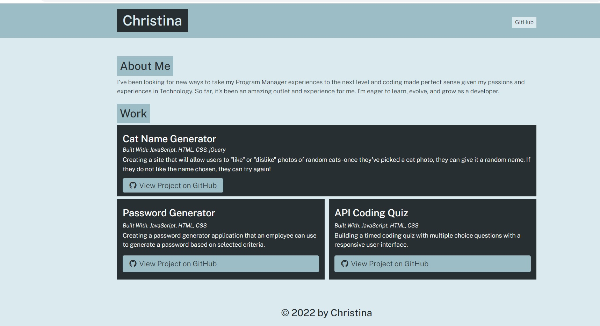

**Project Title:**

Portfolio Site Generator

---

**Project Description/Summary:**

Creating a Node.js application that dynamically generates a site after recieving user input via the terminal.

---

**Live Site:**

As this is a site built with Node.js inputs - there is no live site. Please see the "Installation" section.

---

**Technology Used:**

- JavaScript
- HTML
- CSS
- Google Fonts
- Font Awesome
- Node.js

---

**Installation:**

In order to install this application, you will need Node.js on your local computer and have this repo cloned. Once you have that installed properly, you will need to open a terminal - either through VSCode or GitBash and input the command "app node.js". This will trigger a series of user prompts that you will need to complete. The ones that are marked "Required" will require an input and cannot be skipped. Once this is done - a index.html file will be generated under the "dist" subfolder and you can view the site from there.

---

**Screenshot:**

